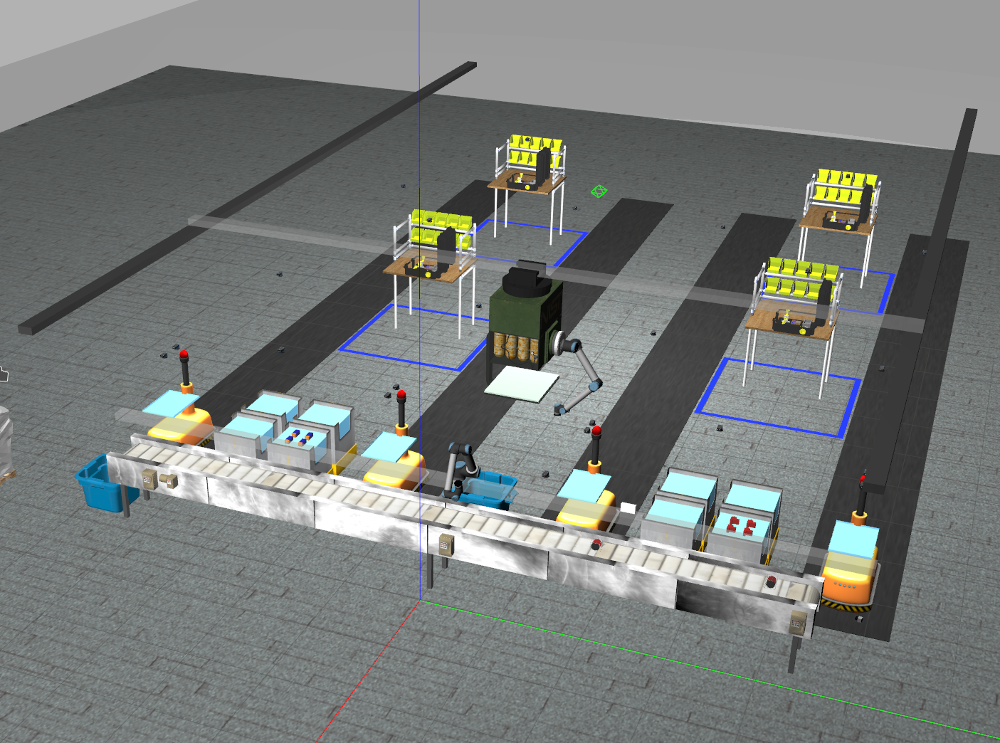
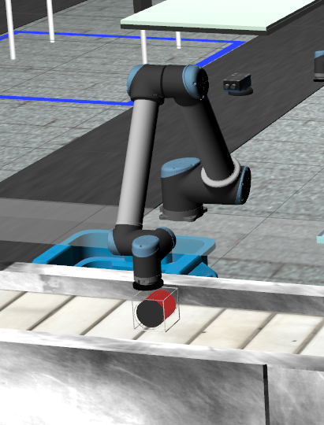
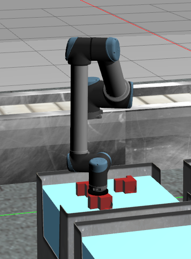
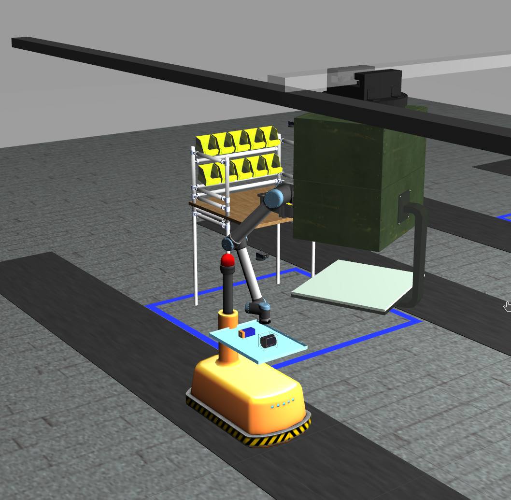
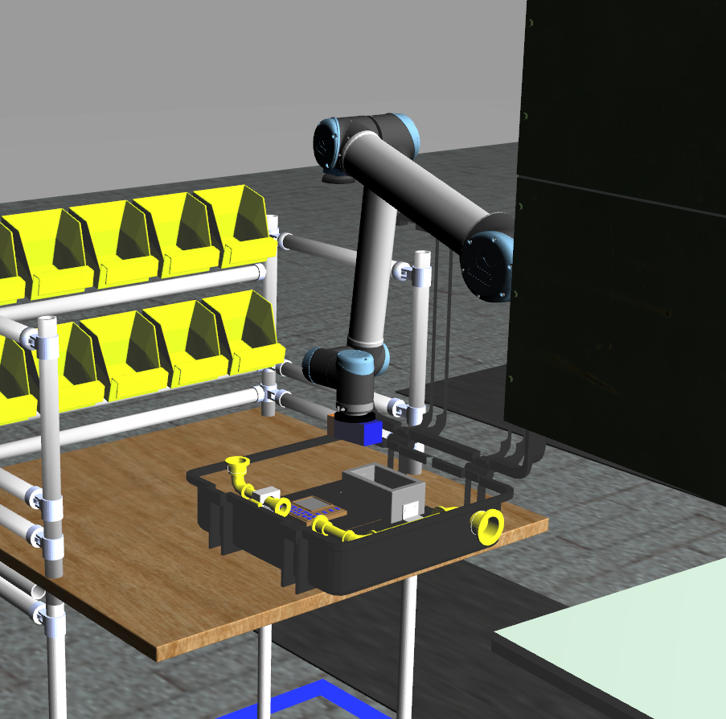

 
 
### ARIAC Installation

To install ARIAC workspace follow the instructions in this link : https://github.com/usnistgov/ARIAC/blob/ariac2022/wiki/tutorials/installation.md

#### HOW TO RUN THE CODE ###

Build the package
    • Extract the Package
    • paste group2_rwa4 in the src folder in ariac_ws
    • catkin clean -y && catkin build
    • source devel/setup.bash

Commands to run the package
    • roslaunch group2_rwa4 ariac.launch

Note:
    • As long as the real time factor is below 0.8,  the package shouldn't throw any error.
    • If the RTF is below 0.8, please adjust the step size in the nist_ gear / worlds / ariac.template file.
    
### About the Project
1. ARIAC Environment
The simulation environment is a representation of an order fulfillment workcell with a kitting robot (on rail) and an assembly robot (gantry robot), a conveyor belt, product bins, assembly stations, a gripper changing station, tables for movable trays, and AGVs.

2. Kitting Process
2.1 Picking moving parts from conveyor

2.2 Picking part from bins for kitting on AGV

3. Assembly Process
3.1 Picking part from the AGV

3.2 Placing part on the Assebly Brief Case

